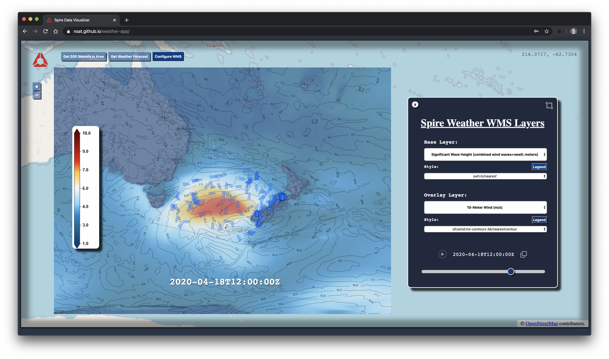

# Authentication

Enter a valid Spire API Token in the prompt when the page loads, and optionally save the token as a password in your browser for autofill

# Maritime Option

Ensure your API token is valid for:

	Spire Maritime's Vessels API

	Spire Weather's WMS and Point API endpoints with the Basic and Maritime bundles

https://nsat.github.io/weather-app/

# Agricultural Option

Ensure your API Token is valid for:

	Spire Weather's WMS and Point API endpoints with the Basic and Agricultural bundles

Specify `bundles=agricultural` as a URL parameter

https://nsat.github.io/weather-app/?bundles=agricultural

# Developers

To start understanding the code, the best entry points are `index.html` and `js/on_load.js`
